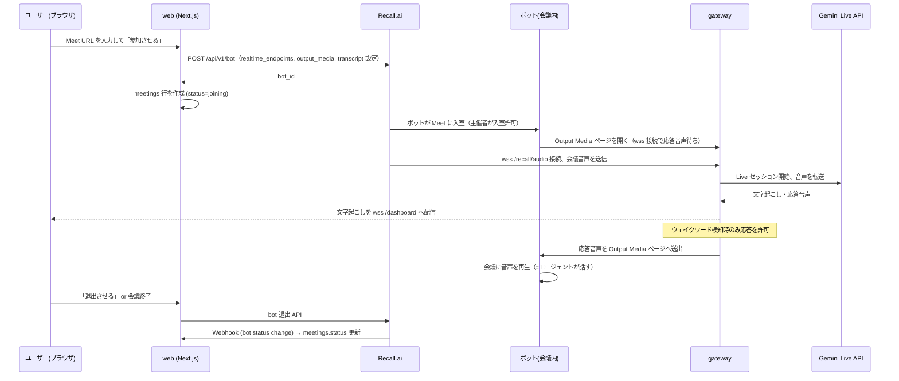

# proto-recall.ai 仕様書

Google Meet に AI ボイスエージェントを送り込み、リアルタイムに音声で会話できる個人向け Web サービスのプロトタイプ。

## 1. 背景・ゴール

- Recall.ai の Meeting Bot API + Output Media を使い、Google Meet の会議に「聞いて・話す」エージェントを参加させる。
- Web サービス側では Google アカウントでログインし、自分のエージェントの設定・ボットの呼び込み・リアルタイム文字起こしの閲覧ができる。
- 個人運用前提のため、**待機中のインフラコストをほぼゼロ**にする（Cloud Run ゼロスケール + 既存 Cloud SQL 相乗り）。

### 非ゴール（MVP ではやらない）

- 組織管理・権限・課金（ログインユーザーごとに環境が分かれれば良い）
- カレンダー連携による自動参加（Recall.ai の Calendar 連携で後付け可能）
- Zoom / Teams 対応（Recall.ai 的には設定差分のみ。まず Meet に集中）
- 会議後の要約・アクションアイテム抽出（ロードマップ参照）

## 2. 全体アーキテクチャ

```
┌─ Google Meet ─────────────────────────────┐
│  参加者たち   Recall.ai ボット(Chromium)    │
└───────────────┬───────────▲───────────────┘
        会議の音声│           │Output Media ページ
     (WebSocket) │           │(gateway が配信する HTML + 応答音声)
                 ▼           │
┌─ GCP (asia-northeast1) ────┴───────────────────────────┐
│  Cloud Run: gateway（会議中だけ稼働・min 0 / max 1）      │
│   ├─ Recall からの音声受信 (wss /recall/audio)           │
│   ├─ 対話エンジン adapter（Gemini Live API / OpenAI）    │
│   ├─ Output Media ページ配信 + 応答音声送出              │
│   └─ ダッシュボードへ文字起こし配信 (wss /dashboard)      │
│                                                        │
│  Cloud Run: web（Next.js・min 0）                       │
│   ├─ Google ログイン（Auth.js）                          │
│   ├─ エージェント設定 CRUD / ボット呼び込み               │
│   └─ Recall.ai REST API 呼び出し（bot 作成・退出）        │
│                                                        │
│  既存 Cloud SQL (PostgreSQL) ← 専用 DB を追加            │
│  Secret Manager / Artifact Registry                     │
└────────────────────────────────────────────────────────┘
              │                          │
              ▼                          ▼
   Recall.ai API (ap-northeast-1)   Gemini API (AI Studio)
```

- Recall.ai のリージョンは **ap-northeast-1（東京）** を使用。
- 対話エンジンは adapter 化し、既定 **Gemini Live API**（音声25トークン/秒・安価・AI Studio 無料枠あり）、切替で OpenAI Realtime。
- 文字起こしは MVP では **Meet キャプション流用（`meeting_captions`）** を既定とし、精度が必要になったら外部 STT（Deepgram 等）へ差し替え。

## 3. 画面仕様（3画面）

### 3.1 ログイン
- Google アカウントでサインイン（Auth.js + Google Provider）。
- 初回ログイン時に `users` へ upsert。

### 3.2 ダッシュボード（エージェント設定 + 呼び込み）
- エージェント設定フォーム: 表示名（= ウェイクワード）、システムプロンプト、言語（既定 ja）、エンジン（gemini / openai）、声、**入室時録音アナウンスの ON/OFF**（既定 ON）。
  - アナウンスは Output Media ページの初回接続（= 入室完了）を合図に、エンジンへ挨拶指示を1ターン送って自分の声で喋らせる。再接続時には繰り返さない。
- ボット呼び込み: Meet URL を貼って「参加させる」→ `POST /api/bots`。
- 過去の会議一覧（status、開始・終了時刻、文字起こしへのリンク）。

### 3.3 ライブビュー
- リアルタイム文字起こしのストリーム表示（話者・時刻付き）。
- エージェント状態表示: idle / listening / thinking / speaking。
- 介入操作: 「発話を止める」「退出させる」（MVP は退出のみ必須）。

## 4. 主要フロー

### 4.1 ボット召喚〜会話〜終了



### 4.2 Cloud Run 60分タイムアウトへの対処

- Cloud Run のリクエスト上限（3600秒）で WebSocket が切れても、**Recall.ai 側が3秒間隔×最大30回自動再接続する**（公式仕様）。影響は約1時間に1回・数秒の音声欠落。
- gateway は `max_instances = 1` + session affinity で全接続を同一インスタンスに集約し、再接続時に既存の会議セッション（対話エンジンの接続・コンテキスト）へ再アタッチする。
- 自プロセス側は接続断でセッションを破棄せず、meeting_id キーで一定時間（例: 5分）保持する。

### 4.3 ウェイクワード制御

- MVP: エンジンからのリアルタイム文字起こしにエージェント名（例:「リコールさん」）が含まれたら応答ウィンドウを開き、1応答で閉じる。
- システムプロンプトでも「名前を呼ばれたときだけ応答する」旨を指示し、二重にガードする。

## 5. データモデル（PostgreSQL）

`db/schema.sql` が正。概要:

| テーブル | 主なカラム | 備考 |
|---|---|---|
| users | id, google_sub (uniq), email, name | Auth.js の Google プロファイルから upsert |
| agents | id, user_id, name, system_prompt, language, engine, voice, wake_word | ユーザーごとに複数可 |
| meetings | id, user_id, agent_id, meeting_url, recall_bot_id, status, started_at, ended_at, minutes(jsonb) | status: joining / in_call / done / failed。minutes は自動生成の議事録 |
| transcript_segments | id, meeting_id, speaker, text, ts_ms | gateway が文単位にバッファして永続化 |

## 6. API（web の Route Handlers）

| メソッド/パス | 役割 |
|---|---|
| `POST /api/bots` | Recall.ai へ bot 作成、meetings 行作成 |
| `DELETE /api/bots/:id` | bot を退出させる |
| `GET /api/meetings` / `GET /api/meetings/:id` | 一覧・詳細（文字起こし含む） |
| `POST /api/webhooks/recall` | Recall.ai の bot status change Webhook 受信。会議終了（done）で議事録を自動生成 |
| `GET/PUT /api/agents` | エージェント設定 CRUD |

一覧・設定・召喚・議事録再生成は Next.js の Server Actions（`app/dashboard/actions.ts`）としても実装している。

### 6.1 議事録の自動生成

- 会議終了 Webhook（または画面の「議事録を生成」ボタン）で、保存済み `transcript_segments` を
  Gemini（`GEMINI_TEXT_MODEL`、既定 `gemini-2.5-flash`）に渡して
  `{ summary, decisions[], actionItems[] }` の JSON を生成し `meetings.minutes` に保存する。
- リアルタイム性が不要なバッチ処理なので、コストは1会議あたり数円レベル。
- 会議ページでは議事録 → 文字起こし全文の順に表示。ダッシュボードの履歴には
  会議ごとの概算コスト（$1.35/h 換算）と今月の合計を表示する。

gateway 側 WebSocket:

| パス | 相手 | 内容 |
|---|---|---|
| `wss /recall/audio?meeting=…&token=…` | Recall.ai → gateway | 会議音声（受信） |
| `wss /output?meeting=…&token=…` | Output Media ページ → gateway | 応答音声（送信） |
| `wss /dashboard?meeting=…&token=…` | ブラウザ → gateway | 文字起こし・状態（送信） |
| `GET /output-media?meeting=…&token=…` | Recall.ai ボットの Chromium | Output Media ページ本体 |

`token` は meeting ごとに web が発行する短命トークン（HMAC）。gateway は検証必須。

## 7. 外部サービスと必要な準備

| サービス | 準備 |
|---|---|
| Recall.ai | ap-northeast-1 の API キー / Output Media の有効化確認 / Webhook URL 設定 |
| Google AI Studio | Gemini API キー（無料枠で開発可） |
| OpenAI（任意） | Realtime 用 API キー（エンジン切替時のみ） |
| Google Cloud Console | OAuth クライアント（Web）、承認済みリダイレクト URI に web の URL |

## 8. インフラ・コスト方針

- **アイドル時 ≈ ¥0/月**: Cloud Run ×2 は min 0。DB は既存 Cloud SQL に相乗り。ドメインは `*.run.app` を使い LB を持たない。
- **会議1時間あたり ≈ $1.2〜1.4**: Recall $0.50 + 文字起こし $0.15 + Gemini Live 〜$0.5 + Cloud Run 〜$0.2。
- Terraform 2スタック構成（`infra/README.md` 参照）: `persistent`（DB/レジストリ/Secret、原則残す）と `runtime`（Cloud Run/IAM、気軽に apply/destroy）。
- コスト暴走ガード: bot 作成時に `automatic_leave`（全員退出・待機室タイムアウト・最大在室時間）を必ず設定。

## 9. リスクと確認事項

- [ ] Output Media がアカウントで有効か（無効ならサポートへ）
- [ ] Recall リアルタイム音声のフォーマット実測（想定: S16LE 16kHz mono, base64）
- [ ] Gemini Live のモデル名は変動が速い（`GEMINI_LIVE_MODEL` 環境変数で差し替え可能にしてある）
- [ ] Gemini Live の長時間セッション（context window compression / session resumption の設定）
- [ ] Cloud SQL 接続方式: パブリック IP（コネクタ）か プライベート IP（Direct VPC egress）か → `db_connect_mode` 変数
- [ ] Meet の入室許可運用（ボットは待機室に入る。主催者が承認）
- [x] 録音の同意: 入室時にエージェントが一言アナウンスする（エージェント設定でON/OFF、既定ON）

## 10. ロードマップ

1. **M1（動く骨格）**: bot 召喚 → 音声往復 → ダッシュボードに文字起こし
2. **M2（体験）**: ウェイクワード精度、入室アナウンス、ライブビュー介入操作
3. **M3（記録）**: ~~会議後アーカイブ、要約・アクションアイテム~~ → **実装済み**（文字起こし永続化 + 会議終了時の議事録自動生成 + コスト概算表示。§6.1）
4. **M4（運用）**: GitHub Actions + Workload Identity Federation で CI/CD、カスタムドメイン + LB、カレンダー自動参加
